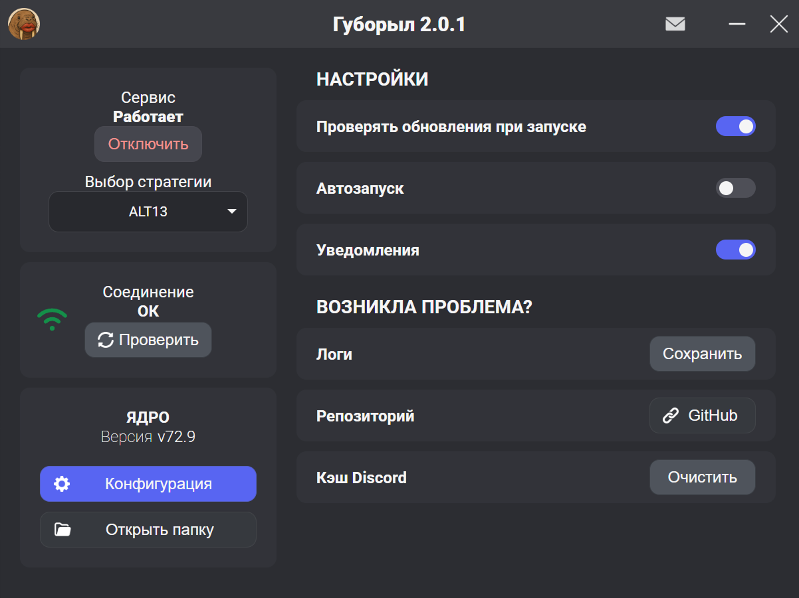

# Губорыл - GUI для Service.bat

Данное приложение является GUI менеджером для `winws.exe`, регистрирует его как службу, автоматически перезапускает при изменении любых настроек и хранит их. Также есть возможность обновлять все стратегии/бинарные файлы для `winws.exe`.

> [!NOTE]
>
> ## БЫСТРАЯ УСТАНОВКА
>
> * Нажать кнопку `скачать`
> * Запустить установочный `.exe` файл и установить
> * Запустить Guboril.exe двойным щелчком мыши (не обязательно от имени администратора, приложение само запросит себе права через UAC)

> [!IMPORTANT]
>
> * Чтобы удостовериться, что тут всё чисто, проверьте `.exe` файл через [Virustotal](https://www.virustotal.com/gui/home/upload) или ваш антивирус.
> * Поскольку приложению требуется доступ к службам Windows, Guboril автоматически запрашивает админ права при запуске.
> * Приложение для автозапуска использует планировщик задач Windows. Это нужно, чтобы избежать раздражающего окна UAC при каждом запуске Windows. Так что в диспетчере задач в автозагрузках оно отображаться **не будет**! Для ручного удаления из автозагрузки нажмите Win+R и введите `taskschd.msc`, там найдите "Guboril" и удалите.
> * Приложение написано под https://youtu.be/areTnBFkvU4?si=r3659dgYMJXJopOK

> [!WARNING]
> Антивирусы Kaspersky и Windows Defender могут ругаться на файлы из `Appdata/Roaming/Guboril/core`

## Как это работает?
* Данное приложение написано на **Electron** (фреймворк Node js для создания десктопных приложений)
* GUI (графический интерфейс) написан на **React** и **Typescript.**
* Приложение работает в режиме `contextIsolation: true` и `NodeIntegration: false`
* Основные модули
  * Папка `./public/Mainwindowr` - renderer процесс электрона, отрисовка GUI
  * Main.js - основной (main) процесс электрона, здесь подключаются все модули, настраиваются окна и тп
  * Preload - API мост между Mainwindow и main.js
  * Core - Оркестратор управляющий всеми базовыми функциями приложения
  * SCContoller - Модуль, управляющий службой через `sc.exe`
  * SCEventLogFacade - Модуль, читающий логи службы через журнал `System`

## Как собрать приложение самому?

Если вы мне не доверяете :C Ну или хотите внести какие-то изменения в код.

* Скачать и установить [Node.js](https://nodejs.org/dist/v25.2.1/node-v25.2.1-x64.msi "Установить Node.Js") (ссылка на скачивание)\. Для проверки ввести в консоль `npm -v` и `node -v`, после этого в консоли должны появится версии.  Чтобы открыть консоль, нужно ввести в поиск windows "cmd" и выбрать "запуск от имени администратора".
* Скачать source code из [Releases](https://github.com/EnderYeekkay/Guboril/releases), распаковать содержимое в пустую папку (не рекомендую скачивать текущий коммит, т.к такая версия кода может оказаться слишком сырой). Выполнить в ней консольную команду ``npm i.`` Чтобы выполнить команду в папке, следует задать каталог через команду  `cd`, подробности тут: https://ab57.ru/cmdlist/cd.html
* Собрать приложение командой ``npm run build`` (cmd должно быть запущено от имени админа), бинари появятся в папке `dist`.

###### ДОПОЛНИТЕЛЬНО:

* Скачать и установить [Inno Setup](https://jrsoftware.org/download.php/is.exe?site=2)
* Задать путь к Inno Setup в файле `package.json` в 10-й строке. Замените `\"A:\\Programs\\Inno Setup 6\\ISCC.exe\"` на путь к .exe файлу.
* Собрать инсталлер командой `npm run mi`, установщик появится в папке `dist/Output`

## Чистое удаление:

* Запустить файл `unins000.exe` из корневой папки Guboril`а
